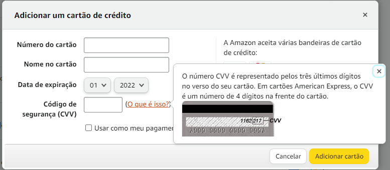
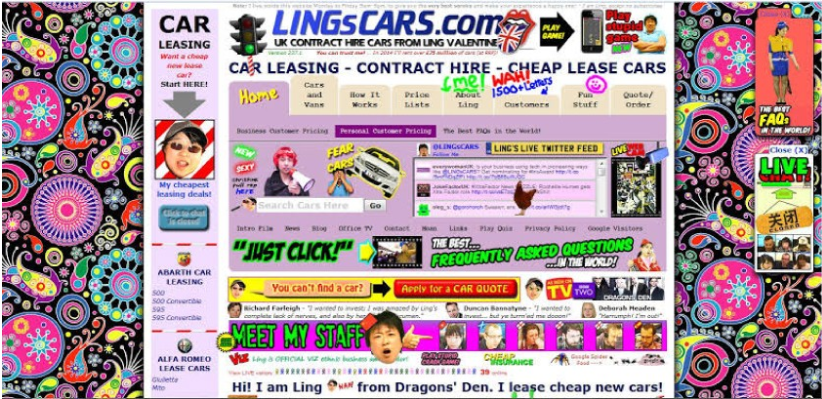
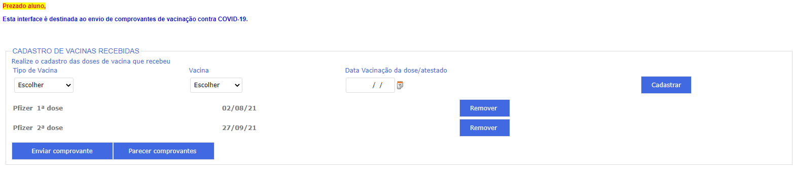

# Atividade das Heurísticas de Nielsen/WCAG
Repositório destinado a disciplina IHC ministrada pelo Professor Giuliano Bertoti

## Acertos

   
<b>1. Visibilidade e Status do Sistema</b>
   
       
     
O site em questão aqui é o Globo Esporte. O seu player de video mostra qual video está sendo reproduzido , quais serão os proximos de sua playlist e os videos já assistidos.

      
     
  

    
  

   
<b>3.3.3 Sugestão de Erro </b>

    
    
Se um erro de entrada for detectado automaticamente e as sugestões de correção forem conhecidas, as sugestões serão fornecidas ao usuário. Nesse caso, o exemplo do Spotify fica bem claro a forma de correta de utilizar...

   

 

    
  

   
<b>3.3.5 Ajuda </b>
   
    
    
Ajuda sensível ao contexto está disponível. Exemplificando na imagem a Amazon, quando você vai registrar um novo cartão, ele deixa explicito o que é e onde encontrar o CVV no seu cartão.
    
   
  
  

    
  

 

## Erros

   
<b>2.4. Navegável</b>

         
    
Forneça maneiras de ajudar os usuários a navegar, encontrar conteúdo e determinar onde eles estão. Bom, este exemplo mostra o oposto de uma navegabilidade...Cores estouradas,poluição visual, dificuldade de entender onde é "clicavel".

     
  

    
  

   
<b>1.4.8 Apresentação Visual
</b>

         
    
O site da imagem é a plataforma do SIGA. Nele vemos que os espaçamentos estão incorretos, o botao de 'cadastrar' esta fora de padrão posicional e textos sem padronização de espaçamentos.

     
  

    
  

